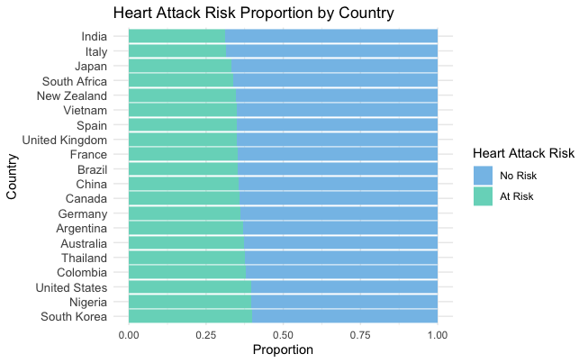
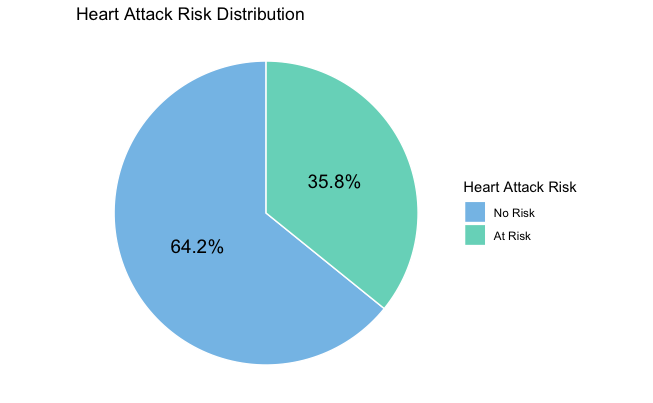

# Heart Attack Risk Prediction

## Overview
This project aims to predict heart attack risk using health, lifestyle, and demographic factors across global populations. Leveraging a simulated dataset of 8,763 patient records and 24 input features, we applied classification models (SVM, Random Forest, k-NN, Logistic Regression, and more) to evaluate risk. Our analysis includes country-specific insights that can help inform regional prevention strategies and health policy design.

Prepared by: Vy Nguyen, Yanan Sun, Becky Wang, Xinying Wu

Key results include:
- SVM achieved the best overall test accuracy of 64.23%
- Regional feature importance highlighted diverse health drivers, underscoring the importance of localized public health efforts
- Strategic recommendations include tackling obesity, improving diet habits, and focusing on high-risk groups by country

## Dataset
- **Source:** [Heart Attack Prediction Dataset on Kaggle](https://www.kaggle.com/datasets/iamsouravbanerjee/heart-attack-prediction-dataset)  
- **Size:** 8,763 records; 24 features in original data, 52 after dummy encoding  
- **Scope:** Includes patients across multiple countries and continents  
- **Two Versions:**
  - `data`: Categorical features as factors
  - `data1`: Dummy-encoded for numerical modeling

### 📋 Data Dictionary

This dataset contains **24 health and demographic features** organized into four key categories. See `Reports/Final_Data_Dictionary.pdf` for full definitions.

- **6 Demographic Factors:**  
  `Sex`, `Age`, `Country`, `Continent`, `Hemisphere`, `Income`
- **6 Physiological & Clinical Variables:**  
  `Cholesterol`, `Blood.Pressure (Systolic, Diastolic)`, `Triglycerides`, `Heart.Rate`, `BMI`, `Obesity`
- **5 Medical History Factors:**  
  `Diabetes`, `Family.History`, `Previous.Heart.Problems`, `Medication.Use`, `Stress.Level`
- **7 Lifestyle Factors:**  
  `Smoking`, `Alcohol.Consumption`, `Diet`, `Exercise.Hours.Per.Week`,  
  `Physical.Activity.Days.Per.Week`, `Sedentary.Hours.Per.Day`, `Sleep.Hours.Per.Day`

## Tools & Methodology Overview
**Languages & Libraries:** R (ggplot2, rpart, e1071, randomForest, caret)

### Data Preprocessing:
- Encoded binary and multi-category variables
- Created dummy variables for modeling purposes
- Parsed `Blood.Pressure` into systolic and diastolic values
- Exported two versions of data (factor-based and dummy-encoded)

### Exploratory Analysis:
- Risk distribution across age, gender, country, income
- Correlation heatmaps by feature categories

### Modeling Techniques:
- Logistic Regression  
- Naive Bayes  
- k-NN (with Min-Max and Z-Score scaling)  
- Decision Tree (with pruning)  
- Random Forest (with tuning)  
- SVM (tuned RBF kernel)

### Evaluation Metrics:
- Test set accuracy  
- Country-specific accuracy (for k-NN and Logistic Regression)  
- Confusion matrix analysis

## Highlighted Visualizations

**Heart Attack Risk by Country:**  

**Overall Heart Attack Risk Distribution:**  

## Results & Key Insights

### Model Performance on Full Dataset

| Model                  | Test Accuracy (%) |
|------------------------|------------------|
| Logistic Regression    | 55.00            |
| Discriminant Analysis  | 50.00            |
| k-NN                   | 51.67            |
| Decision Tree          | 51.32            |
| Random Forest          | 51.37            |
| SVM (Tuned)        | 64.23       |

### k-NN Model Accuracy by Country

| Country        | Test Accuracy (%) |
|----------------|-------------------|
| Italy       | 68             |
| Japan       | 66             |
| United States  | 49                |
| China          | 48                |

### Strategic Health Implications

- **Italy** should prioritize **obesity reduction**, **healthcare access for low-income populations**, and **monitoring patients with heart history**
- **Japan** should focus on **preventive care**, including **heart rate monitoring**, **diet improvement**, and **specialized services** for prior heart conditions
- Localized patterns suggest health campaigns and interventions must be **region-specific** rather than generic

## Key Deliverables
- R script: `Heart_Attack_Risk_Prediction.R`  
- Final presentation (PDF)  
- Data dictionary and appendix (PDF)

## What I Learned
- **Model assumptions matter**: Logistic Regression and Naive Bayes underperformed due to linearity and independence assumptions  
- **SVMs are powerful** for non-linear patterns but require careful parameter tuning  
- Country-level breakdowns provide more actionable insights than global averages  
- Data quality and balance are essential; simulated data can lead to model bias

## What I Plan to Improve
- Test on real-world healthcare datasets (e.g., UCI Heart Disease)
- Explore deep learning or ensemble stacking models
- Integrate time-based features for longitudinal health analysis
- Conduct deeper regional analysis across more countries

## About Me
Hi, I’m Vy Nguyen and I’m currently pursuing my MS in Business Analytics at UC Irvine. I’m passionate about data analytics in Finance and Investment.  
Connect with me on [LinkedIn](https://www.linkedin.com/in/vy-ngoc-lan-nguyen).
